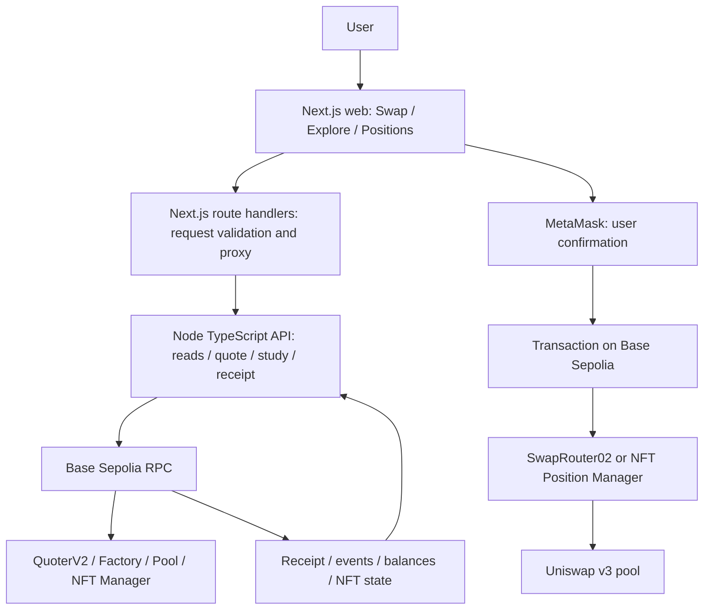
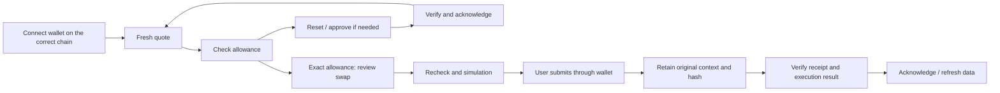
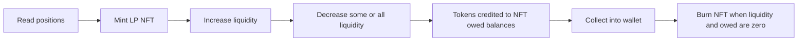

# VEZTA DEX — MECHANISM & DEMO REPORT

**Protocol mechanics, architecture, and user experience**

**Date:** October 4, 2026 · **Code checkpoint:** `f8a6094` · **Demo network:** Base Sepolia, `84532`

**Language:** English · [Vietnamese version](2026-10-04-vezta-dex-mechanism-report.md)

This report describes the standalone DEX in `vezta-dex`, following the launchpad report format: overview → architecture → mechanics → configuration → wallet → application experience → demo. Future features are listed separately in Section 9.

> The project owner reports that every functional desktop testnet acceptance check passed. The refreshed compact interface has passed automated checks and mock screenshot review; owner visual acceptance remains pending. The demo currently runs locally. It has not been deployed to Vercel or integrated into the main Vezta application.

## 1. Executive summary

**Vezta DEX lets users trade spot tokens and manage Uniswap liquidity using their own wallets.** Vezta provides the interface, data, and transaction validation workflow. Existing Uniswap pools and deployed contracts execute the underlying operations.

The product has three main areas:

| Area | What can users do? | Demo route |
|---|---|---|
| **Swap** | Exchange test USDC ↔ WETH; review quotes, minimum output, approvals, and execution results | `/demo/1` |
| **Explore** | Inspect the selected pool, its fee, and liquidity depth through quote samples | `/demo/3`, with details at `/demo/4` |
| **Positions** | Read LP NFTs, create positions, add/remove liquidity, collect tokens, and close positions | `/demo/2` |

The current scope is **one chain, one token pair, and one Uniswap v3 pool**. Swaps take place within the same chain. Vezta has not issued its own AMM, router, or LP token. The demo does not implement an order book/CLOB or a prediction market.

This approach uses existing liquidity and contracts so development can focus on accurate quotes, bounded token permissions, verified results, and wallet usability. Multi-chain execution, mainnet, and integration into `vezta.io/{swap,explore,pools,...}` are later milestones.

## 2. End-to-end architecture & transaction lifecycle

### 2.1. System layers



| Component | Responsibility |
|---|---|
| `apps/web` | Next.js 16/React interface, MetaMask connection, review, submission, and browser recovery |
| `apps/api` | Node HTTP/TypeScript service for RPC reads, unsigned transaction preparation, runtime checks, simulation, and receipt verification |
| `packages/core` | Chain/token/pool identities, schemas, integer amounts, and calldata/approval policies |
| Uniswap contracts | Pricing, token transfers, liquidity management, and NFT ownership |

RPC URLs and API credentials stay on the server. The wallet manages keys and confirmation prompts; the API does not sign on the user's behalf. For the supported MetaMask EIP-7702 profile, a relayer may submit the outer transaction, while the inner action must still match the user's reviewed operation.

### 2.2. Swap lifecycle



An approval only grants token permission. The swap is a separate action requiring a valid quote and review. Changing the account, chain, or input invalidates the previous review.

### 2.3. LP lifecycle



Each operation has its own study, review, wallet confirmation, receipt verification, and acknowledgment. After a mutation, the previous position scan is marked historical and the user reads the updated state.

## 3. DEX mechanics: AMM, CLMM, swapping & LP earnings

### 3.1. AMM and the constant-product model

An automated market maker uses pooled liquidity and mathematical rules to quote trades. In the constant-product model associated with Uniswap v2, ignoring fees:

```text
x × y = k
```

Here, `x` and `y` are the reserves of the two tokens. For an additional input `Δx` and fee rate `f`, the simplified output formula is:

```text
effectiveInput = Δx × (1 − f)
amountOut = y × effectiveInput / (x + effectiveInput)
```

A trade that is large relative to reserves receives a worse execution price than the initial spot price. Fees retained by the pool can increase the actual reserve product. This explains the underlying concept; the current demo executes through v3. [Uniswap v2 Pair source](https://github.com/Uniswap/v2-core/blob/master/contracts/UniswapV2Pair.sol).

### 3.2. CLMM — concentrated liquidity

Uniswap v3 lets LPs choose a price range instead of distributing capital across the entire price domain. In-range liquidity participates in swaps and earns fees. Outside the range, the position holds one side of the pair and stops earning fees until the price returns. Narrow ranges concentrate capital but require management as the price moves. [Uniswap concentrated liquidity](https://developers.uniswap.org/docs/get-started/concepts/liquidity-providers/concentrated-liquidity).

Prices are organized into **ticks**. For the raw-unit token1/token0 price ratio:

```text
Praw at tick boundary t = 1.0001^t
Current Praw = (sqrtPriceX96 / 2^96)^2
Phuman = Praw × 10^(decimals0 − decimals1)
```

In the demo pool, token0 is USDC with 6 decimals and token1 is WETH with 18 decimals. Therefore, `Phuman` represents WETH per USDC; its reciprocal represents USDC per WETH. Both the Q96 scaling and token decimals must be accounted for. [Uniswap TickMath](https://github.com/Uniswap/v3-core/blob/main/contracts/libraries/TickMath.sol).

To understand a position's principal, let `a = √P_lower`, `b = √P_upper`, `s = √P_current`, and `L` be its liquidity. The idealized formulas in raw units are:

| State | Token0 in the position | Token1 in the position |
|---|---|---|
| `s ≤ a` | `L × (1/a − 1/b)` | `0` |
| `a < s < b` | `L × (1/s − 1/b)` | `L × (s − a)` |
| `s ≥ b` | `0` | `L × (b − a)` |

Execution uses integers, fixed-point arithmetic, and specific rounding rules. Vezta uses the v3 SDK for principal and transaction planning, then validates the resulting payload. The table explains the mechanics. [Uniswap SqrtPriceMath](https://github.com/Uniswap/v3-core/blob/main/contracts/libraries/SqrtPriceMath.sol).

The demo mints **full-range positions** to reduce the number of decisions required from testers. These remain v3 positions, but they do not offer the capital efficiency of a range concentrated around the current price.

### 3.3. Quotes, price impact, and slippage

The demo reads QuoterV2 through RPC for one fixed v3 pool. **Estimated received** is the expected output at the observed snapshot. **Minimum received** is the reviewed lower bound encoded into the transaction.

```text
minimumAmountOut = floor(quotedAmountOut × 9950 / 10000)
```

For illustration, a quote of `0.006 WETH` has a minimum of `0.00597 WETH` at 0.5% slippage. Transaction construction uses integer amounts with 18 decimals, rather than JavaScript floating-point arithmetic.

The two concepts have different roles:

- **Price impact:** the effect of trade size relative to the pool's fee-adjusted spot price.
- **Slippage tolerance:** the allowed deterioration between the quote and execution. If the swap cannot meet its minimum output, it must revert.

The depth screen reads six samples at the same block. It passes only when every sample has a quote and no more than 1% price impact after fees. This does not establish a fair market price: test tokens have no reliable USD valuation. Each transaction still needs a fresh quote, simulation, and review.

### 3.4. How do LPs earn fees?

Swap fees accrue to active liquidity; the share allocated to LPs depends on the protocol fee configuration. The demo pool has a 0.3% swap fee, which does not imply that the full 0.3% always belongs to LPs. The demo does not charge an additional Vezta application fee. [Uniswap fees](https://developers.uniswap.org/docs/get-started/concepts/fees).

For each token `i`, new fees since the last checkpoint are derived from fee growth inside the position's range:

```text
newFee_i = floor(L × ΔfeeGrowthInside_i / 2^128)
estimatedCollectable_i = storedOwed_i + newFee_i
```

Fee-growth differences use uint256 modular subtraction. Checkpoints and rounding must match the contracts. [Uniswap Position accounting](https://github.com/Uniswap/v3-core/blob/main/contracts/libraries/Position.sol).

Vezta separates four values:

| Label | Meaning |
|---|---|
| **Current principal** | Tokens currently represented by liquidity deposited in the pool |
| **New fees since checkpoint** | Fees derived from fee growth since the last position update |
| **Stored owed · mixed** | Amounts already credited to the NFT; these may include fees and principal from a decrease |
| **Estimated collectable** | Stored owed plus new fees; minor rounding differences may remain |

**Collected tokens are not necessarily profit.** After a decrease, collection can include the withdrawn principal itself. Evaluating LP performance requires comparison with holding the original assets, changes in the token ratio, earned fees, and transaction costs. The demo does not calculate PnL or USD APR.

**Impermanent loss** is the unfavorable difference between the value of an LP position and holding the original tokens as their relative prices change. Fees may offset part of this difference, but they are not guaranteed to cover it. Withdrawing the position can realize the difference.

### 3.5. How do AMM, CLMM, and DLMM differ?

| Model | Capital allocation | Status in Vezta DEX |
|---|---|---|
| Constant-product AMM | Liquidity spans the full price domain; usually represented by fungible LP tokens | Foundational theory, with separate Polygon routing research |
| CLMM, such as Uniswap v3 | LPs select tick ranges; an NFT manager represents positions | Execution model for the Base Sepolia demo |
| DLMM, such as Meteora | Liquidity sits in discrete price bins, with dynamic fee mechanisms | Educational reference; not integrated |

Meteora DLMM maintains a fixed price while a trade stays within the same bin. Once liquidity is consumed, trading moves to another bin. Zero price slippage within a bin does not guarantee zero impact across an entire trade. Fees may include a base component and a variable component that responds to volatility. [Meteora DLMM](https://docs.meteora.ag/core-products/dlmm/what-is-dlmm).

Uniswap v4 also uses concentrated-liquidity mathematics, with its own architecture and hooks. A v3 adapter does not establish v4 compatibility. [Uniswap LP calculations](https://developers.uniswap.org/docs/get-started/concepts/liquidity-providers/lp-calculations).

## 4. Demo parameters & deployed contracts

### 4.1. Current parameters

| Parameter | Value |
|---|---|
| Chain / protocol | Base Sepolia `84532` / Uniswap v3 |
| Pair / pool fee | Test USDC ↔ WETH / `3000` = **0.3%** |
| Tick spacing | `60` |
| Swap | Exact input through one fixed pool; no comparison across multiple routes |
| USDC → WETH inputs | `0.1`, `1`, `5` USDC |
| WETH → USDC inputs | `0.00001`, `0.0001`, `0.001` WETH |
| Slippage / depth impact limit | `0.5%` / `1%` after fees |
| New demo quotes | `120 seconds`; older contexts without the policy marker retain `30 seconds` |
| Swap study freshness | Less than `30 seconds`, with the quote also unexpired |
| LP study lifetime | Up to `120 seconds`; recheck before submission |
| Mint range | `-887220 → 887220`, valid full range for tick spacing 60 |
| Maximum LP authorization caps | `5 USDC` and `0.05 WETH` |
| Decrease | `25%`, `50%`, `100%` of liquidity |
| Receipt verification | At least `2 confirmations`, with canonical block and action-result checks |

A longer quote lifetime makes review more practical. It does not extend simulation validity or authorize submission of stale contexts. Configuration sources: [swap policy](../../packages/core/src/testnet-swap.ts), [LP policy](../../packages/core/src/testnet-lp-wallet.ts), and [depth policy](../../packages/core/src/testnet-depth.ts).

### 4.2. Base Sepolia registry

| Contract | Address |
|---|---|
| Test USDC · 6 decimals | `0x036CbD53842c5426634e7929541eC2318f3dCF7e` |
| WETH · 18 decimals | `0x4200000000000000000000000000000000000006` |
| UniswapV3Factory | `0x4752ba5DBc23f44D87826276BF6Fd6b1C372aD24` |
| QuoterV2 | `0xC5290058841028F1614F3A6F0F5816cAd0df5E27` |
| SwapRouter02 · swap spender | `0x94cC0AaC535CCDB3C01d6787D6413C739ae12bc4` |
| NFT Position Manager · LP spender | `0x27F971cb582BF9E50F397e4d29a5C7A34f11faA2` |
| USDC/WETH v3 pool · 0.3% | `0x46880b404CD35c165EDdefF7421019F8dD25F4Ad` |

Uniswap deployments were checked against the [official Base/Base Sepolia registry](https://developers.uniswap.org/docs/protocols/v3/deployments/v3-base-deployments). The selected tokens and pool are also checked through RPC and the [repository registry](../../packages/core/src/testnet.ts).

Token identity includes `chainId + address`; matching symbols do not establish token identity. The router, quoter, factory, pool, and manager have rebuild/runtime evidence. The API checks their pinned runtime code when preparing actions. See the [runtime gate](../research/2026-10-02-testnet-runtime-quote-gate.md).

## 5. Approval, transaction fees & result verification

### 5.1. Bounded token permissions

| Current allowance | Action |
|---|---|
| Exactly equal to the required amount | Ready; no new approval transaction |
| Zero | Approve exactly the required amount |
| Nonzero and different from the required amount | Reset to zero; verify and reread, then approve the exact amount |

Swaps authorize the exact **input amount** for SwapRouter02. LP actions authorize the exact **selected cap** for the NFT manager. These are different spenders. The Base Sepolia demo uses direct ERC20 approvals, rather than the Polygon workspace's Permit2 flow.

An LP's planned deposit may be smaller than its cap to match the pool ratio. Unused allowance may remain. The next action rereads allowance and resets it if it differs from the new cap. Exact approval does not mean that allowance must always be zero after minting or increasing liquidity.

Minting may require a USDC approval, a WETH approval, and then the mint itself, each with a separate confirmation. Increasing liquidity may require additional resets/approvals. Decrease, collect, and burn do not require renewed USDC/WETH spending permission for the manager.

### 5.2. Pool fees and network fees

The pool fee is part of swap mechanics. Gas is a separate cost paid in native test ETH. WETH does not directly replace the native ETH balance needed for gas.

The current review budget is:

```text
L2 fee ceiling = gasLimit × gasPrice ceiling
completeSnapshotBudget = L2 fee ceiling
                       + 2 × (L1 fee upper bound + operator fee upper bound)
```

Swap and approval gas limits include a buffer over the estimate. For EIP-1559 transactions, the ceiling corresponds to the maximum fee normalized from the transaction fields. This is a **snapshot budget**, rather than the final amount charged.

Fork tests verify actions and token accounting, but do not establish the complete actual L1/operator fees on public testnet. The report and interface continue to distinguish the budget from observed L2 cost. With a relayer, the outer transaction's gas payer may differ from the position or token owner.

### 5.3. Before and after submission

Before submission, the system checks the chain, account/profile, runtime, intent, allowance, balances, nonce, expiry, calldata, and simulation. Insufficient tokens or gas produce a blocked state; read-only quotes may still be available.

After submission, an explorer's success status alone is insufficient for application verification. The application reconciles the original transaction, receipt, block, events, balances, or NFT state against the reviewed context. A swap is verified only when its output meets the original minimum. LP verification reconciles the token ID, owner, liquidity, and token amounts for the corresponding action.

| Status | Meaning / next action |
|---|---|
| `pending` / `confirming` | Evidence or confirmations are incomplete; check the original hash again later |
| `confirmed` with a verified result | Reconciliation succeeded; acknowledge before continuing |
| `unverified` | A receipt may exist, but the application has not established a context match; retain the record and inspect the diagnostic |
| `reorged` / uncertain outcome | Retain original recovery; new submission remains blocked |
| Quote/review expired before submission | Request a fresh quote/study |

The original context and hash are retained for recovery. Reloading does not automatically open a prompt or resend a transaction. Unresolved recovery blocks new actions across both Swap and LP. **Check original transaction** only reads status.

## 6. Wallet connection & MetaMask compatibility

**Connect wallet** is in the top-right header. The popup uses the official MetaMask logo. Opening it does not request wallet permission; selecting MetaMask initiates connection. Switching networks is a separate action. Base Sepolia uses `84532`, while Ethereum Sepolia uses `11155111`.


*Interface screenshot from a mocked browser check. The fox comes from the official asset pack; see its [provenance](../../apps/web/public/wallets/README.md).*

Connecting does not approve tokens or submit transactions. Every approval, reset, swap, and LP action still requires review and a wallet prompt. The DEX currently uses an external wallet. It does not implement the launchpad report's Privy email login, embedded trading subwallet, deposit wallet, or key export features.

Current support covers direct accounts and the **verified MetaMask EIP-7702 profile**, including the nested swap path with balance checks. For delegated execution, the application validates the inner action instead of requiring every outer transaction field to match an EOA transaction. Delegation contracts, batches, or permissions outside the selected profile are not automatically accepted. See the [nested swap investigation](../research/2026-10-04-metamask-nested-swap-investigation.md).

The application does not request a private key or seed phrase. An `unverified` result for an unsupported profile must be resolved using evidence before further submissions.

## 7. Exploring the app — desktop user flow

**Screenshot convention:** the six images in this report come from mocked browser checks of the compact interface on October 4. Amounts, NFT IDs, ticks, blocks, and countdowns are illustrative fixtures. They do not show current prices or public-testnet receipts. Actual configuration is listed in Section 4. In particular, the narrow-range position and 30-second quote fixtures do not change the full-range mint policy or the new 120-second demo quote policy.

### 7.1. Explore and pool details

Open `/demo/3` and click **Refresh pool data**. The compact table shows the token pair, Uniswap v3, the fee, and the depth status. **View pool detail** opens `/demo/4`, showing pool identity and six quote samples in both directions. Source and block information are expandable.


Unavailable USD TVL/APR are explicitly labeled. The `liquidity()` value is not USD TVL. Passing the depth screen still requires a separate transaction review. Users can continue through **Swap USDC / WETH** or **Manage liquidity**.

### 7.2. Swap USDC → WETH


1. Connect MetaMask on Base Sepolia and select the direction and amount.
2. Click **Get wallet quote**; inspect estimated received, minimum received, and slippage.
3. Click **Review swap**. If allowance is missing, the application directs you to **Review approval**.
4. For a reset or approval, review the token, amount, spender, and budget. Submit, check the original transaction until verified, then acknowledge.
5. Obtain a fresh quote and review the swap. Inspect simulated output, minimum, and budget.
6. Click **Submit reviewed testnet transaction** and confirm in MetaMask.
7. Check the original transaction until confirmed and verified. Inspect **Verified executed output**, then acknowledge.

WETH → USDC uses the same sequence. Insufficient input tokens or gas require testnet funding; a successful quote does not establish that the wallet is funded. Manual allowance checks are under **More review options**.

### 7.3. Positions: read a wallet and create a position


Enter an address or click **Use connected wallet**, then **Read LP positions**. Reading an address requires no signature. **No positions owned** is valid after a completed scan finds no NFTs; RPC errors are shown separately.

The list displays the owner/NFT ID, range, principal, fees, and owed balances. Actions are available for supported pair/pool NFTs. A partial scan is not a complete inventory; use **Scan next NFT** when needed.

Click **Create position** to open the side form. **Back to positions** discards an unsent study. Original transaction recovery remains visible after reload.


### 7.4. Complete LP lifecycle

| Step | Operation | Expected meaning |
|---|---|---|
| **Mint** | Select USDC/WETH caps → Study LP action → complete each required token reset/approval → review mint → submit | A new NFT, liquidity, and **Actual tokens deposited** are verified |
| **Increase** | Select Add liquidity/NFT ID → caps → study → approval if needed → review increase | Capital is added to the same NFT; no new NFT is created |
| **Partial decrease** | Remove liquidity 25%/50% → study → submit | Liquidity decreases; tokens are credited to owed balances, not yet transferred to the wallet |
| **Full decrease** | Remove liquidity 100% | Liquidity becomes zero; owed tokens remain available to collect |
| **Collect** | Collect tokens → study → submit | Tokens move to the wallet; **Actual tokens collected** are reconciled |
| **Burn** | Close position when liquidity and owed balances are zero | The NFT is closed and disappears from the ownership list |

After each verified receipt: **Acknowledge verified LP result → Read LP positions**. Planned deposit, minimum deposit, and maximum authorization are shown separately. Repeating the study after each approval ensures the next plan uses updated allowance and state.

### 7.5. Recovery and rejected prompts

Users can reject a prompt without the application reporting success. Before submission, changing input or action requires a new review. Once a hash exists, reload preserves the original hash/context and requires checking that transaction before continuing.

Keep the API running while tracking. Do not delete the recovery record to try resubmitting. Detailed instructions and error-reporting templates are in the [desktop owner guide](../research/2026-10-02-testnet-desktop-owner-guide.md).

## 8. Demo video & presentation plan

**Video:** not attached yet. This section proposes a recording sequence after visual acceptance of the refreshed interface.

| Order | Screen | Recording content |
|---|---|---|
| 1 | Explore `/demo/3` | Introduce the pool, Base Sepolia, and its 0.3% fee |
| 2 | Details `/demo/4` | Data provenance and quotes in both directions; explain unavailable testnet USD TVL/APR |
| 3 | Header popup | Select MetaMask and connect to the correct chain |
| 4 | Swap `/demo/1` | Quote → approval if needed → review → submit → verified output |
| 5 | Reverse swap | WETH → USDC; retain some WETH for LP testing |
| 6 | Positions `/demo/2` | Mint → new NFT → increase → decrease → collect → burn |
| 7 | Recovery segment | Reload after receiving a hash and check the original transaction without resending |

To shorten the video, edit out confirmation waits and show one decrease operation. Keep the distinctions between approval and swap, and between decrease and collect, clear. Editing should not make an unverified transaction appear successful.

From the `vezta-dex` directory configured according to the README, run:

```bash
pnpm dev:testnet
```

The web application runs at `http://127.0.0.1:3020`; the API runs at `http://127.0.0.1:3021`. Enable this launcher when performing testnet actions. Use `pnpm dev` for read-only flows. `/demo` is a simulation requiring no wallet or assets, distinct from `/demo/1`–`/demo/4`.

The recording wallet needs test USDC, WETH, and native test ETH. Mainnet USDC is unnecessary. Select LP caps appropriate to the actual balances; screenshot fixture amounts and prices should not determine funding requirements.

## 9. Delivery status, evidence & next milestones

### 9.1. Available evidence

| Area | Status and evidence type |
|---|---|
| Pool/contract identity and runtime | Registry, pinned RPC, and independent rebuild; quote/preparation checks runtime |
| Swap and LP consumers | Mock/unit checks and disposable local forks; forks do not use owner assets |
| Desktop public-testnet checklist | **Owner-reported pass** for both swap directions, the LP lifecycle, rejection, and recovery; a complete set of new LP hashes has not been supplied for independent reconciliation |
| Compact UI and MetaMask header | Implemented, with mocked browser checks and screenshot review; owner visual acceptance remains pending |
| Latest automated verification | 134 Vitest files: **1008 passed, 1 skipped**; **85 Node tests passed** |
| Latest browser checks | **30 swap, 48 LP wallet, 13 LP ownership, 12 Explore/detail, 13 wallet chooser checks** |
| Typecheck, lint, and production build | Passed in the UI session; the build used a separate copy to preserve the active development server |
| Actual complete L1/operator fees | Not yet qualified; budget and observed L2 cost remain separate |
| Public hosting / remote CI | Public-domain deployment acceptance has not been completed |

Checkpoint sources: [roadmap](../roadmap.md), [UI verification](../research/2026-10-04-compact-demo-ui.md), and [receipt/recheck evidence](../research/2026-10-02-testnet-recheck-receipt.md). These test counts were recorded in the implementation/UI session; they were not rerun while writing or translating this report. AI review, simulation, and tests do not replace an independent audit.

### 9.2. Selected decisions and rationale

- **Reuse deployed Uniswap contracts:** avoid operating a new AMM and bootstrapping liquidity from scratch.
- **Direct v3 RPC adapter on Base Sepolia:** remove reliance on testnet Trading API routing that previously returned timeouts/404s, while keeping the quote scope explicit.
- **0.3% pool:** selected from preflight/depth evidence; this is not a claim of the best price across all pools.
- **Pinned artifacts and selected SDKs:** viem handles chain communication, and the v3 SDK handles position math. Source checkouts are used when verification requires them; continuing the demo does not require forking all of `v4-core`.
- **Bounded authorization and required recovery:** no unlimited approvals; new actions remain blocked while an earlier submission is unresolved.
- **Swap / Explore / Positions interface:** fewer primary buttons, with amount, minimum, and budget retained in reviews and expandable provenance.

### 9.3. Roadmap after this report

1. **Review the desktop interface and record the video:** inspect the fox popup, Swap card, Positions form, and Explore/details. Repeat the funded lifecycle only if a regression is found.
2. **Prepare hosted testnet:** the proposed shape is Vercel for the web app and one separate Node API with durable storage. HTTPS origin allowlists, proxy trust, API authentication, request budgets, and runtime packaging are required. Current writes are restricted to loopback development; adding Vercel environment variables is insufficient.
3. **Accept the hosted domain:** test origin handling, restart/recovery, and a wallet swap/LP sample in the new environment. Local acceptance does not establish hosting correctness.
4. **Complete the standalone product:** mobile at its separate milestone, reliable pool/indexing data, observability/CI, and fee reporting.
5. **Mainnet and additional chains:** requalify tokens, pools, liquidity, fees, and wallet profiles. Each chain requires its own registry and evidence. Multi-pool routing, Universal Router, and API use are evaluated against actual needs.
6. **Integrate into the main Vezta application:** share routes, authentication, and wallet state after the standalone gates pass. Cross-chain transfers are a separate later flow.

Implementation details are in [Vercel readiness](../research/2026-10-04-vercel-readiness.md), the [testnet roadmap](../superpowers/plans/2026-10-01-standalone-testnet-completion.md), and the [Uniswap dependency strategy](../superpowers/plans/2026-10-01-uniswap-dependency-and-adapter-strategy.md).

## 10. Using this report in Notion

Import this Markdown file into Notion or copy its sections. Images are in the adjacent `assets/` directory. If the import does not resolve relative image paths, upload the six PNGs at their corresponding positions. Mermaid diagrams may need to be rendered as images or placed in an appropriate block for your Notion workspace. Formulas are provided as plain text so they remain readable without LaTeX support.

Repository-relative links to supporting documents and source files remain useful locally, but may need published URLs or separately imported pages in Notion. External reference links already use full URLs.

When a video is available, add its link to Section 8. After deployment or a scope change, update the date, checkpoint, and status table while keeping illustrative data, testnet evidence, and mainnet evidence distinct.
