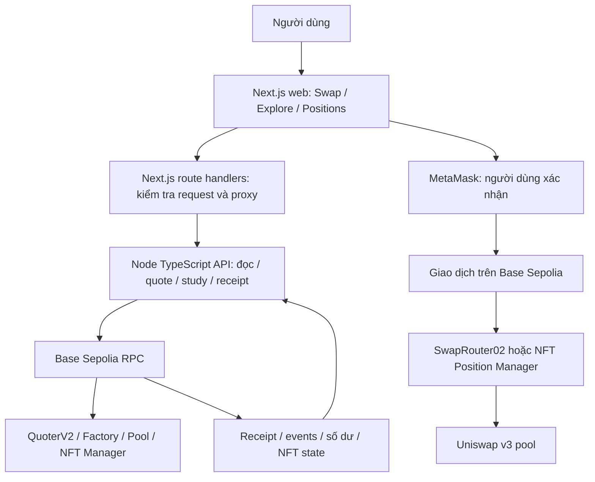
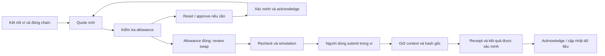
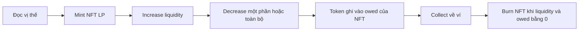
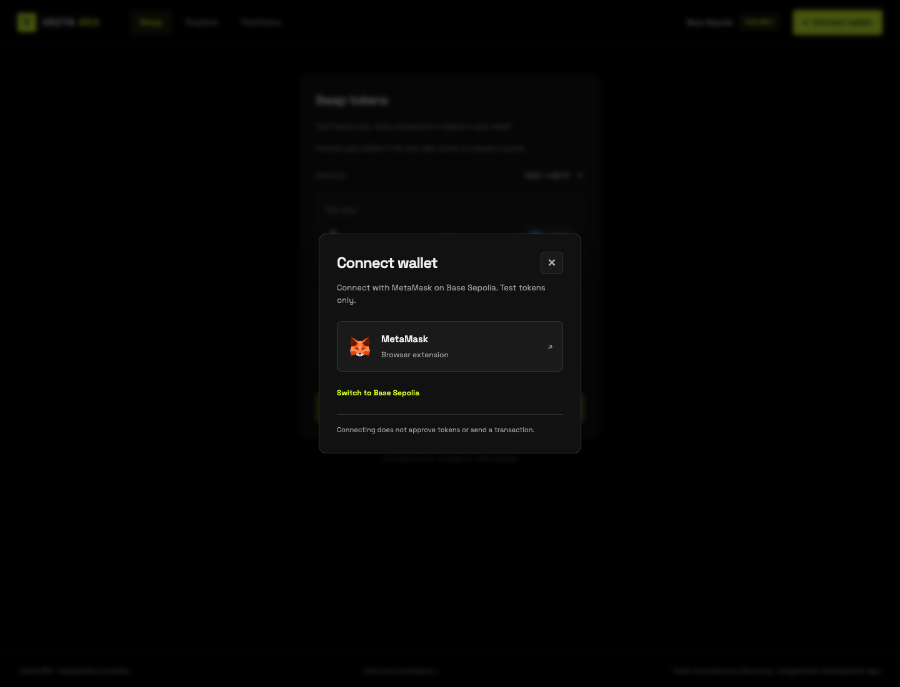
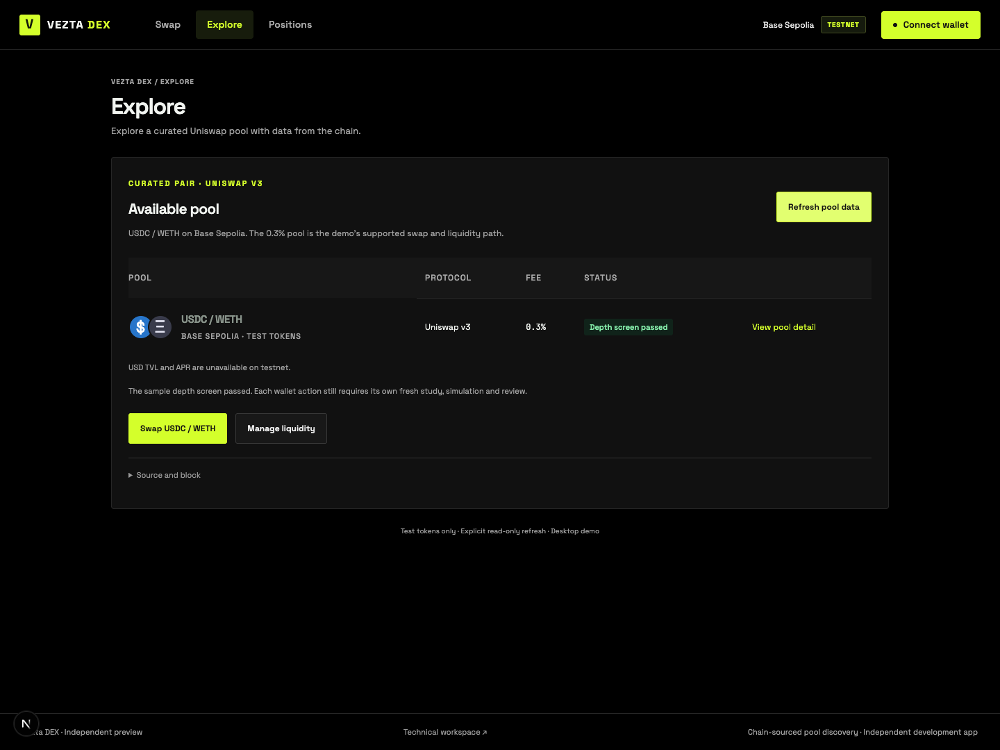
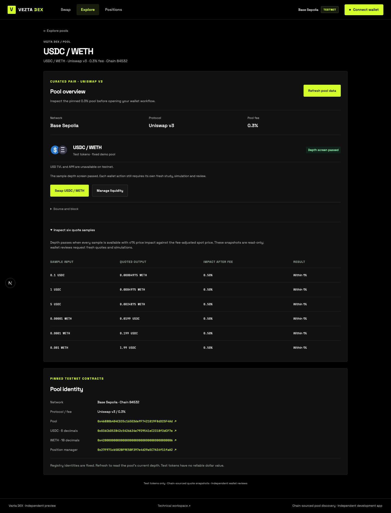
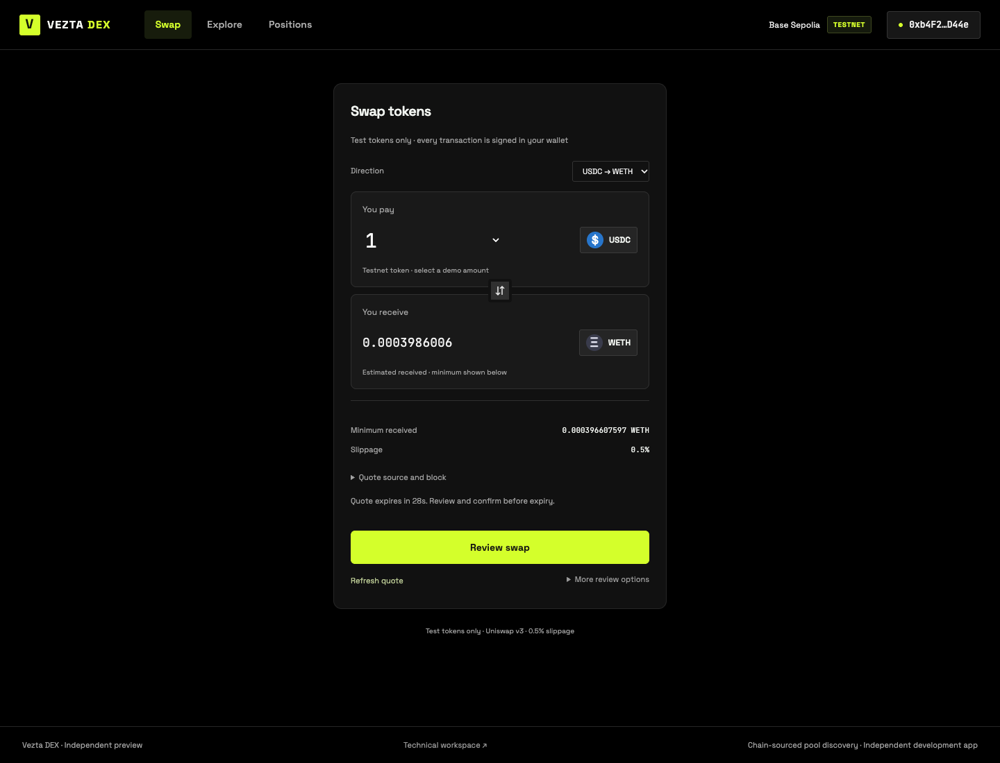
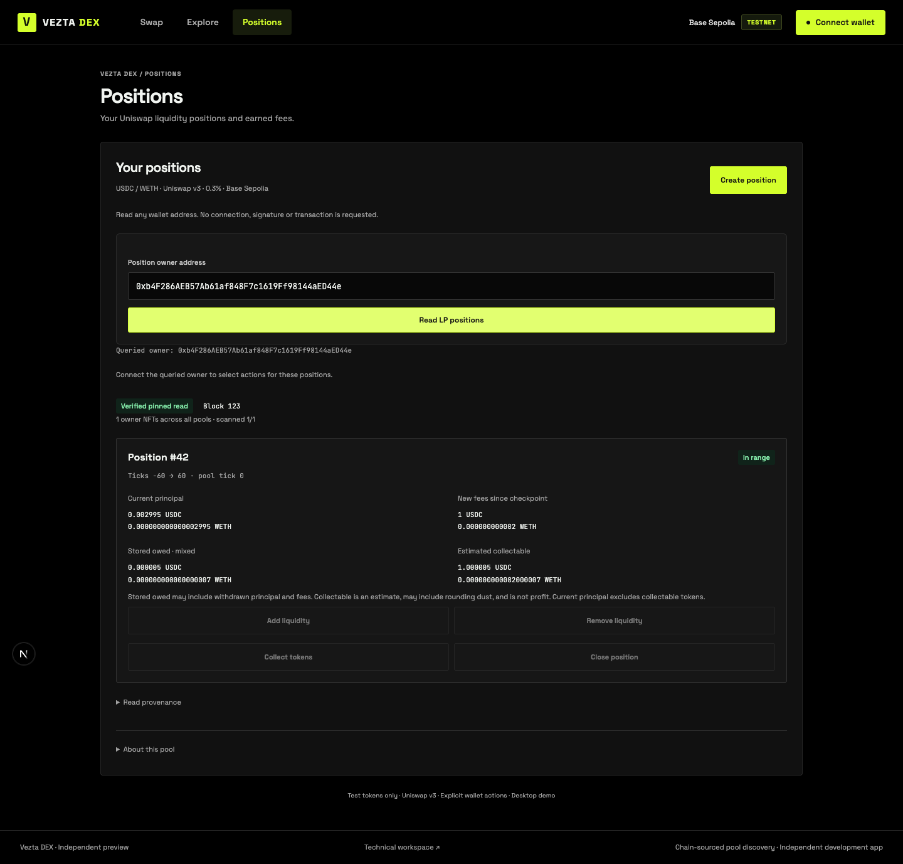
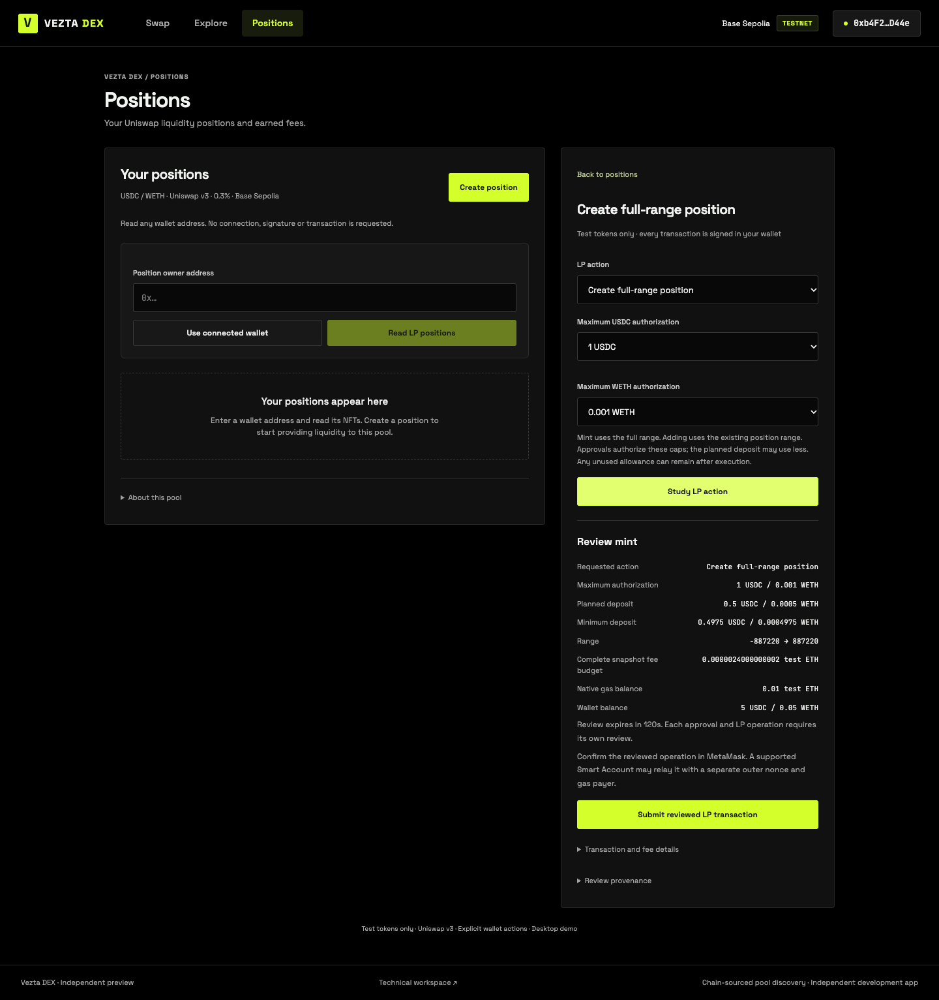

# VEZTA DEX — MECHANISM & DEMO REPORT

**Báo cáo cơ chế, kiến trúc và trải nghiệm sử dụng**

**Ngày:** 04/10/2026 · **Mốc code:** `f8a6094` · **Mạng demo:** Base Sepolia, `84532`

**Ngôn ngữ:** Tiếng Việt · [English version](2026-10-04-vezta-dex-mechanism-report.en.md)

Tài liệu mô tả bản DEX độc lập trong `vezta-dex`, theo cấu trúc báo cáo launchpad: tổng quan → kiến trúc → cơ chế → cấu hình → ví → trải nghiệm ứng dụng → demo. Các tính năng tương lai được ghi riêng ở mục 9.

> Chủ dự án đã xác nhận toàn bộ checklist chức năng desktop testnet đạt. Giao diện compact mới đã qua kiểm tra tự động và ảnh mock; cần chủ dự án xem lại hình thức. Bản demo hiện chạy local, chưa triển khai Vercel và chưa tích hợp vào Vezta chính.

## 1. Executive summary

**Vezta DEX giúp người dùng giao dịch spot và quản lý thanh khoản trên Uniswap bằng ví của họ.** Vezta cung cấp giao diện, dữ liệu và quy trình kiểm tra giao dịch; các pool và hợp đồng thực thi thuộc Uniswap đã triển khai.

Ba khu vực sản phẩm chính:

| Khu vực | Người dùng làm gì? | Route demo |
|---|---|---|
| **Swap** | Đổi test USDC ↔ WETH; xem báo giá, minimum, approval và kết quả thực thi | `/demo/1` |
| **Explore** | Xem pool được chọn, phí và độ sâu qua các mẫu quote | `/demo/3`, chi tiết `/demo/4` |
| **Positions** | Đọc NFT LP, tạo vị thế, thêm/rút thanh khoản, collect và đóng vị thế | `/demo/2` |

Phạm vi hiện tại là **một chain, một cặp token và một pool Uniswap v3**. Swap thực hiện trong cùng chain. Vezta chưa phát hành AMM, router hay token LP riêng, chưa có order book/CLOB hoặc prediction market.

Lựa chọn này tận dụng thanh khoản và hợp đồng hiện hữu, giúp tập trung vào báo giá đúng, quyền sử dụng token có giới hạn, xác minh kết quả và trải nghiệm ví. Multi-chain, mainnet và tích hợp `vezta.io/{swap,explore,pools,...}` là các mốc tiếp theo.

## 2. End-to-end architecture & transaction lifecycle

### 2.1. Các lớp của hệ thống



| Thành phần | Vai trò |
|---|---|
| `apps/web` | Next.js 16/React; giao diện, kết nối MetaMask, review, submit và recovery phía trình duyệt |
| `apps/api` | Node HTTP/TypeScript; đọc RPC, chuẩn bị giao dịch chưa ký, kiểm tra runtime, simulation và receipt |
| `packages/core` | Danh tính chain/token/pool, schema, số tiền nguyên và quy tắc calldata/approval |
| Hợp đồng Uniswap | Định giá, chuyển token, quản lý thanh khoản và quyền sở hữu NFT |

RPC URL/API credentials ở server. Ví quản lý khóa và yêu cầu xác nhận; API không ký thay người dùng. Với profile MetaMask EIP-7702 được hỗ trợ, giao dịch ngoài có thể do relayer gửi, còn hành động bên trong vẫn phải khớp review của ví.

### 2.2. Lifecycle swap



Nhánh approval chỉ cấp quyền token. Swap là một hành động riêng, với quote và review còn hiệu lực. Thay đổi account, chain hoặc input làm review cũ mất hiệu lực.

### 2.3. Lifecycle LP



Mỗi thao tác có study, review, xác nhận ví, kiểm tra receipt và acknowledge riêng. Sau thay đổi, scan vị thế cũ được đánh dấu historical; người dùng đọc lại dữ liệu.

## 3. DEX mechanism: AMM, CLMM, swapping & LP earnings

### 3.1. AMM và mô hình constant product

AMM dùng thanh khoản trong pool và quy tắc toán học để báo giá. Với mô hình constant product điển hình của Uniswap v2, bỏ qua phí:

```text
x × y = k
```

`x`, `y` là dự trữ hai token. Nếu gửi thêm `Δx`, với tỷ lệ phí `f`, lượng token đầu ra theo mô hình đơn giản là:

```text
effectiveInput = Δx × (1 − f)
amountOut = y × effectiveInput / (x + effectiveInput)
```

Giao dịch lớn so với dự trữ làm giá thực hiện xấu hơn giá spot. Phí giữ lại trong pool khiến tích dự trữ thực tế có thể tăng. Đây là phần lý thuyết nền; demo hiện thực thi v3. [Mã nguồn Uniswap v2 Pair](https://github.com/Uniswap/v2-core/blob/master/contracts/UniswapV2Pair.sol).

### 3.2. CLMM — concentrated liquidity

Uniswap v3 cho LP chọn khoảng giá thay vì phân bổ vốn trên toàn bộ miền giá. Vị thế trong khoảng giá đang hoạt động tham gia swap và tích lũy phí; ngoài khoảng, vốn chuyển về một phía và không kiếm phí cho đến khi giá quay lại. Range hẹp tăng mức tập trung vốn nhưng cần quản lý khi giá di chuyển. [Uniswap concentrated liquidity](https://developers.uniswap.org/docs/get-started/concepts/liquidity-providers/concentrated-liquidity).

Giá được chia thành **tick**. Với giá theo đơn vị nguyên của token1/token0:

```text
Praw tại biên tick t = 1.0001^t
Praw hiện tại = (sqrtPriceX96 / 2^96)^2
Phuman = Praw × 10^(decimals0 − decimals1)
```

Pool demo có token0 = USDC (6 decimals), token1 = WETH (18 decimals). Vì vậy `Phuman` là WETH trên một USDC; muốn USDC trên một WETH thì lấy nghịch đảo. Không bình phương `sqrtPriceX96` rồi bỏ qua hệ số Q96 hoặc decimals. [Uniswap TickMath](https://github.com/Uniswap/v3-core/blob/main/contracts/libraries/TickMath.sol).

Để hiểu phần vốn của vị thế, đặt `a = √P_lower`, `b = √P_upper`, `s = √P_current`, `L` là liquidity. Công thức lý tưởng theo đơn vị nguyên:

| Trạng thái | Token0 trong vị thế | Token1 trong vị thế |
|---|---|---|
| `s ≤ a` | `L × (1/a − 1/b)` | `0` |
| `a < s < b` | `L × (1/s − 1/b)` | `L × (s − a)` |
| `s ≥ b` | `0` | `L × (b − a)` |

Thực thi dùng số nguyên, fixed point và quy tắc làm tròn. Vezta dùng v3 SDK để tính vốn/plan, rồi kiểm tra lại payload; bảng trên dùng để giải thích cơ chế. [Uniswap SqrtPriceMath](https://github.com/Uniswap/v3-core/blob/main/contracts/libraries/SqrtPriceMath.sol).

Demo mint **full range** để giảm số quyết định cho người thử nghiệm. Full range vẫn là vị thế v3, nhưng không khai thác hiệu quả vốn như range tập trung quanh giá.

### 3.3. Quote, price impact và slippage

Quote của demo đọc QuoterV2 qua RPC, cố định một pool v3. **Estimated received** là đầu ra dự kiến tại snapshot; **Minimum received** là giới hạn đã review và được đưa vào calldata.

```text
minimumAmountOut = floor(quotedAmountOut × 9950 / 10000)
```

Ví dụ minh họa: quote `0.006 WETH` thì minimum với slippage 0,5% là `0.00597 WETH`. Tính trên số nguyên 18 decimals, không dùng JavaScript floating point để xây giao dịch.

Hai khái niệm khác nhau:

- **Price impact:** mức ảnh hưởng của kích thước giao dịch so với giá spot của pool đã điều chỉnh phí.
- **Slippage tolerance:** khoảng chấp nhận thay đổi từ quote đến lúc thực thi. Nếu không đạt minimum, giao dịch swap phải revert.

Depth screen đọc sáu mẫu ở cùng block; điều kiện đạt là mỗi mẫu có quote và impact sau phí không quá 1%. Điều này không chứng minh pool có giá thị trường hợp lý: test token không có định giá USD đáng tin cậy. Mỗi giao dịch vẫn cần quote, simulation và review mới.

### 3.4. LP kiếm phí như thế nào?

Phí giao dịch được phân bổ cho liquidity đang hoạt động; phần dành cho LP phụ thuộc cấu hình protocol fee. Pool demo có swap fee 0,3%; không suy ra toàn bộ 0,3% luôn thuộc LP. Demo chưa thu thêm application fee cho Vezta. [Uniswap fees](https://developers.uniswap.org/docs/get-started/concepts/fees).

Với mỗi token `i`, phí mới kể từ checkpoint được tính từ fee growth bên trong range:

```text
newFee_i = floor(L × ΔfeeGrowthInside_i / 2^128)
estimatedCollectable_i = storedOwed_i + newFee_i
```

Fee growth dùng phép trừ modulo uint256; checkpoint và việc làm tròn phải khớp hợp đồng. [Uniswap Position accounting](https://github.com/Uniswap/v3-core/blob/main/contracts/libraries/Position.sol).

Vezta tách bốn số liệu:

| Nhãn | Ý nghĩa |
|---|---|
| **Current principal** | Token hiện còn đại diện cho liquidity đang gửi vào pool |
| **New fees since checkpoint** | Phí mới tính từ fee growth kể từ lần cập nhật vị thế |
| **Stored owed · mixed** | Khoản đã ghi nợ cho NFT; có thể gồm phí và vốn đã decrease |
| **Estimated collectable** | Stored owed cộng phí mới; có thể còn sai khác làm tròn nhỏ |

**Collect không đồng nghĩa lợi nhuận.** Sau decrease, khoản collect có thể gồm chính vốn đã rút. Đánh giá hiệu quả LP cần so với việc giữ nguyên tài sản, biến động tỷ lệ token, phí kiếm được và chi phí giao dịch. Demo chưa tính PnL/USD APR.

**Impermanent loss** là phần chênh lệch bất lợi giữa giá trị vốn LP và giá trị nếu giữ nguyên các token ban đầu, khi giá tương đối thay đổi. Phí có thể bù một phần nhưng không bảo đảm đủ; khi rút vốn, chênh lệch đó có thể được hiện thực hóa.

### 3.5. AMM, CLMM và DLMM khác nhau thế nào?

| Mô hình | Cách phân bổ vốn | Tình trạng ở Vezta DEX |
|---|---|---|
| Constant-product AMM | Thanh khoản trên toàn miền giá; thường đại diện bằng LP token fungible | Lý thuyết nền, có nghiên cứu routing Polygon riêng |
| CLMM, ví dụ Uniswap v3 | LP chọn khoảng tick; vị thế được NFT manager đại diện | Mô hình thực thi demo Base Sepolia |
| DLMM, ví dụ Meteora | Thanh khoản trong các price bin rời rạc; có cơ chế phí động | Tham khảo kiến thức, chưa tích hợp |

Trong Meteora DLMM, giá cố định khi giao dịch còn nằm trong cùng bin; hết thanh khoản sẽ chuyển sang bin khác. “Không trượt giá trong một bin” không bảo đảm toàn bộ giao dịch không có impact. Phí có thể gồm phần cơ bản và phần biến đổi theo biến động. [Meteora DLMM](https://docs.meteora.ag/core-products/dlmm/what-is-dlmm).

Uniswap v4 cũng sử dụng mô hình concentrated liquidity, nhưng có kiến trúc và hooks riêng. Việc có adapter v3 không tự động chứng minh tương thích v4. [Uniswap LP calculations](https://developers.uniswap.org/docs/get-started/concepts/liquidity-providers/lp-calculations).

## 4. Demo parameters & deployed contracts

### 4.1. Tham số đang áp dụng

| Tham số | Giá trị |
|---|---|
| Chain / protocol | Base Sepolia `84532` / Uniswap v3 |
| Pair / pool fee | Test USDC ↔ WETH / `3000` = **0,3%** |
| Tick spacing | `60` |
| Swap | Exact input, một pool cố định; chưa so sánh nhiều route |
| Input USDC → WETH | `0.1`, `1`, `5` USDC |
| Input WETH → USDC | `0.00001`, `0.0001`, `0.001` WETH |
| Slippage / depth impact limit | `0,5%` / `1%` sau phí |
| Quote mới của demo | `120 giây`; context cũ không có marker vẫn dùng `30 giây` |
| Swap study freshness | Dưới `30 giây`, đồng thời chưa hết hạn quote |
| LP study lifetime | Tối đa `120 giây`; recheck trước submit |
| Mint range | `-887220 → 887220`, full range hợp lệ với spacing 60 |
| LP authorization caps tối đa | `5 USDC` và `0.05 WETH` |
| Decrease | `25%`, `50%`, `100%` liquidity |
| Xác minh receipt | Ít nhất `2 confirmations`, kiểm tra block canonical và kết quả hành động |

Tăng thời hạn quote giúp review thuận tiện hơn; không kéo dài hiệu lực simulation hoặc cho phép submit context cũ. Nguồn cấu hình: [swap policy](../../packages/core/src/testnet-swap.ts), [LP policy](../../packages/core/src/testnet-lp-wallet.ts), [depth policy](../../packages/core/src/testnet-depth.ts).

### 4.2. Registry Base Sepolia

| Contract | Địa chỉ |
|---|---|
| Test USDC · 6 decimals | `0x036CbD53842c5426634e7929541eC2318f3dCF7e` |
| WETH · 18 decimals | `0x4200000000000000000000000000000000000006` |
| UniswapV3Factory | `0x4752ba5DBc23f44D87826276BF6Fd6b1C372aD24` |
| QuoterV2 | `0xC5290058841028F1614F3A6F0F5816cAd0df5E27` |
| SwapRouter02 · spender của swap | `0x94cC0AaC535CCDB3C01d6787D6413C739ae12bc4` |
| NFT Position Manager · spender của LP | `0x27F971cb582BF9E50F397e4d29a5C7A34f11faA2` |
| USDC/WETH v3 pool · 0,3% | `0x46880b404CD35c165EDdefF7421019F8dD25F4Ad` |

Các deployment Uniswap được đối chiếu với [registry chính thức Base/Base Sepolia](https://developers.uniswap.org/docs/protocols/v3/deployments/v3-base-deployments). Token/pool cụ thể còn được kiểm tra qua RPC và [registry trong repo](../../packages/core/src/testnet.ts).

Danh tính token phải gồm `chainId + address`; cùng symbol không chứng minh cùng token. Các hợp đồng router, quoter, factory, pool và manager đã có bằng chứng rebuild/runtime; API kiểm tra runtime đã pin khi chuẩn bị hành động. Xem [runtime gate](../research/2026-10-02-testnet-runtime-quote-gate.md).

## 5. Approval, transaction fees & result verification

### 5.1. Quyền sử dụng token có giới hạn

| Allowance hiện tại | Hành động |
|---|---|
| Bằng đúng mức yêu cầu | Ready; không gửi approval mới |
| Bằng 0 | Approve đúng mức yêu cầu |
| Khác 0 và khác mức yêu cầu | Reset về 0; xác minh, đọc lại rồi approve đúng mức |

Swap cấp đúng **amount input** cho SwapRouter02. LP cấp đúng **cap đã chọn** cho NFT manager. Hai spender khác nhau. Demo Base Sepolia dùng ERC20 approval trực tiếp; không sử dụng luồng Permit2 của workspace Polygon.

LP planned deposit có thể nhỏ hơn cap để khớp tỷ lệ pool. Phần allowance chưa sử dụng có thể còn lại; hành động sau đọc lại và reset nếu khác cap mới. “Exact approval” không có nghĩa allowance luôn bằng 0 sau mint/increase.

Mint có thể cần approve USDC, approve WETH rồi mới mint; mỗi bước có xác nhận riêng. Increase có thể cần reset/approve lại. Decrease, collect và burn không cần cấp lại quyền chuyển USDC/WETH cho manager.

### 5.2. Phí pool và phí mạng

Phí pool nằm trong cơ chế swap. Gas là chi phí khác, trả bằng native test ETH; WETH không thay thế số dư native ETH để trả gas trực tiếp.

Budget review hiện tại:

```text
L2 fee ceiling = gasLimit × gasPrice ceiling
completeSnapshotBudget = L2 fee ceiling
                       + 2 × (L1 fee upper bound + operator fee upper bound)
```

Swap/approval dùng gas limit đã buffer từ estimate. Với EIP-1559, phần ceiling tương ứng mức phí tối đa được chuẩn hóa từ trường giao dịch. Đây là **ngân sách tại snapshot**, không phải số tiền cuối cùng sẽ bị tính.

Kết quả kiểm thử fork chứng minh hành động và accounting token, nhưng chưa đủ để xác nhận toàn bộ phí L1/operator thực tế trên public testnet. Báo cáo và UI tiếp tục phân biệt budget với L2 cost quan sát được. Với relayer, người trả gas ngoài có thể khác owner.

### 5.3. Trước và sau submit

Trước submit, hệ thống kiểm tra chain, account/profile, runtime, intent, allowance, balance, nonce, thời hạn, calldata và simulation. Không đủ token hoặc gas thì trả trạng thái blocked; quote vẫn có thể đọc được.

Sau submit, explorer báo success chưa đủ để app xác nhận kết quả. App đối chiếu giao dịch gốc, receipt, block, events, số dư hoặc trạng thái NFT với context đã review. Swap chỉ được xác minh nếu output đạt minimum gốc; LP đối chiếu token ID, owner, liquidity và lượng token của hành động tương ứng.

| Trạng thái | Ý nghĩa / cách xử lý |
|---|---|
| `pending` / `confirming` | Chưa đủ bằng chứng hoặc confirmations; kiểm tra hash gốc sau |
| `confirmed` và kết quả verified | Đã đối chiếu; acknowledge rồi tiếp tục |
| `unverified` | Receipt có thể tồn tại nhưng app chưa chứng minh khớp context; giữ record, đọc diagnostic |
| `reorged` / outcome uncertain | Giữ original recovery; chưa mở hành động gửi mới |
| Quote/review expired, chưa gửi | Yêu cầu quote/study mới |

Context và hash gốc được giữ để recovery. Reload không tự mở prompt hoặc gửi lại. Recovery chưa giải quyết sẽ chặn hành động mới giữa cả Swap và LP. Nút **Check original transaction** chỉ đọc trạng thái.

## 6. Wallet connection & MetaMask compatibility

**Connect wallet** nằm góc phải header. Popup dùng logo MetaMask chính thức; mở popup chưa yêu cầu cấp quyền. Chọn MetaMask mới kết nối account; chuyển mạng là hành động riêng. Base Sepolia dùng `84532`, khác Ethereum Sepolia `11155111`.



*Ảnh giao diện từ browser mock. Asset fox lấy từ gói chính thức; xem [provenance](../../apps/web/public/wallets/README.md).*

Kết nối không approve token hoặc gửi giao dịch. Mỗi approval/reset/swap/LP action vẫn có review và prompt ví. DEX hiện dùng ví ngoài; chưa có Privy email login, embedded trading subwallet, deposit wallet hoặc export key như báo cáo launchpad.

Hỗ trợ hiện tại gồm account trực tiếp và **profile MetaMask EIP-7702 đã được kiểm chứng**, bao gồm đường swap lồng có kiểm tra balance. Với delegation, app kiểm tra hành động bên trong thay vì yêu cầu mọi trường outer transaction giống EOA. Hợp đồng delegation, batch hay permission ngoài profile được chọn không tự động được chấp nhận. Xem [điều tra nested swap](../research/2026-10-04-metamask-nested-swap-investigation.md).

Ứng dụng không yêu cầu private key/seed phrase. Thông báo `unverified` của profile chưa hỗ trợ phải được xử lý bằng bằng chứng, không bỏ qua để tiếp tục gửi.

## 7. Exploring the app — desktop user flow

**Quy ước ảnh:** sáu ảnh trong báo cáo lấy từ kiểm thử browser mock của giao diện compact ngày 04/10. Amount, NFT ID, tick, block và countdown trong ảnh là fixture minh họa; không phải giá hiện tại hay receipt public testnet. Cấu hình thực tế nằm ở mục 4. Đặc biệt, ảnh vị thế range hẹp và quote 30 giây không thay đổi chính sách mint full range/quote mới 120 giây.

### 7.1. Explore và pool detail

Mở `/demo/3`, nhấn **Refresh pool data**. Bảng ngắn hiển thị cặp token, Uniswap v3, fee và trạng thái depth. **View pool detail** mở `/demo/4`; có danh tính pool và sáu mẫu quote hai chiều. Source/block nằm trong phần mở rộng.





Không có TVL USD/APR đáng tin cậy thì hiển thị unavailable. Giá trị `liquidity()` không phải TVL USD. Depth screen đạt vẫn yêu cầu review giao dịch riêng. Người dùng chuyển sang **Swap USDC / WETH** hoặc **Manage liquidity**.

### 7.2. Swap USDC → WETH



1. Connect MetaMask trên Base Sepolia; chọn chiều và amount.
2. Nhấn **Get wallet quote**; đọc estimated received, minimum và slippage.
3. Nhấn **Review swap**. Nếu thiếu allowance, app hướng đến **Review approval**.
4. Với reset/approval: đọc token, amount, spender, budget; submit, kiểm tra original transaction đến khi verified, rồi acknowledge.
5. Lấy quote mới và review swap; đọc simulated output/minimum/budget.
6. Nhấn **Submit reviewed testnet transaction**, xác nhận MetaMask.
7. Kiểm tra original transaction đến khi confirmed/verified; đối chiếu **Verified executed output**, rồi acknowledge.

Swap WETH → USDC dùng cùng trình tự. Không đủ input/gas thì cần nạp test token; việc quote thành công không chứng minh ví đã đủ tiền. Kiểm tra allowance thủ công nằm trong **More review options**.

### 7.3. Positions: đọc ví và tạo vị thế



Nhập address hoặc **Use connected wallet**, rồi **Read LP positions**. Đọc một address không cần ký. **No positions owned** là kết quả hợp lệ nếu scan hoàn tất và ví không có NFT; lỗi RPC được hiển thị riêng.

Danh sách trình bày owner/NFT ID, range, principal, phí và owed. Chỉ NFT thuộc cặp/pool được hỗ trợ mới có các thao tác phù hợp. Kết quả scan từng trang không được hiểu là danh sách toàn bộ khi chưa scan hết; dùng **Scan next NFT** khi cần.

Nhấn **Create position** để mở form bên cạnh; **Back to positions** bỏ study chưa gửi. Original transaction đang recovery vẫn hiện sau reload.



### 7.4. Toàn bộ lifecycle LP

| Bước | Thao tác | Kết quả cần hiểu |
|---|---|---|
| **Mint** | Chọn cap USDC/WETH → Study LP action → hoàn tất reset/approval từng token → review mint → submit | NFT mới, liquidity và **Actual tokens deposited** được xác minh |
| **Increase** | Chọn Add liquidity/NFT ID → cap → study → approval nếu cần → review increase | Thêm vốn vào cùng NFT, không tạo NFT mới |
| **Decrease một phần** | Remove liquidity 25%/50% → study → submit | Liquidity giảm; token được ghi vào owed, chưa về ví |
| **Decrease hết** | Remove liquidity 100% | Liquidity về 0; còn owed để collect |
| **Collect** | Collect tokens → study → submit | Token chuyển về ví; **Actual tokens collected** được đối chiếu |
| **Burn** | Close position khi liquidity và owed bằng 0 | NFT được đóng, không còn trong danh sách sở hữu |

Sau mỗi receipt verified: **Acknowledge verified LP result → Read LP positions**. Planned deposit, minimum deposit và maximum authorization được hiển thị riêng; việc phải study lại sau mỗi approval bảo đảm plan kế tiếp dùng allowance/state mới.

### 7.5. Recovery và trường hợp từ chối

Người dùng có thể reject prompt mà app không báo thành công. Khi chưa submit, thay đổi input/action phải review lại. Khi đã có hash, reload giữ hash/context gốc và chỉ cho kiểm tra giao dịch đó trước khi tiếp tục.

Giữ API chạy khi theo dõi, không xóa recovery record để thử gửi lại. Hướng dẫn thao tác và mẫu báo lỗi nằm trong [desktop owner guide](../research/2026-10-02-testnet-desktop-owner-guide.md).

## 8. Demo video & presentation plan

**Video:** chưa đính kèm. Phần này là kịch bản đề xuất để quay sau khi kiểm tra hình thức UI mới.

| Thứ tự | Màn hình | Nội dung quay |
|---|---|---|
| 1 | Explore `/demo/3` | Giới thiệu pool, Base Sepolia và fee 0,3% |
| 2 | Detail `/demo/4` | Nguồn dữ liệu, hai chiều quote; testnet không có TVL/APR USD |
| 3 | Header popup | Chọn MetaMask và kết nối đúng chain |
| 4 | Swap `/demo/1` | Quote → approval nếu cần → review → submit → verified output |
| 5 | Swap chiều ngược | WETH → USDC; giữ WETH cho LP |
| 6 | Positions `/demo/2` | Mint → NFT mới → increase → decrease → collect → burn |
| 7 | Một đoạn recovery | Reload sau hash, kiểm tra hash cũ; không gửi lần hai |

Có thể rút ngắn video bằng cách cắt thời gian chờ confirmations và chọn một decrease, nhưng nên giữ rõ approval khác swap, decrease khác collect. Không cắt cảnh theo cách khiến giao dịch chưa xác minh trông như đã thành công.

Chạy local từ thư mục `vezta-dex` đã cấu hình theo README:

```bash
pnpm dev:testnet
```

Web tại `http://127.0.0.1:3020`; API tại `http://127.0.0.1:3021`. Chỉ bật launcher này khi thực hiện hành động testnet. `pnpm dev` dùng cho luồng đọc; `/demo` là mô phỏng không dùng ví/tài sản, khác các route `/demo/1`–`/demo/4`.

Ví quay cần test USDC, WETH và native test ETH; không cần USDC thật trên mainnet. Với cap LP, chọn lượng phù hợp balance thực tế, không dùng giá/amount fixture của ảnh để suy ra lượng cần nạp.

## 9. Delivery status, evidence & next milestones

### 9.1. Đã có bằng chứng gì?

| Hạng mục | Trạng thái và loại bằng chứng |
|---|---|
| Pool/contract identity, runtime | Registry, pinned RPC và independent rebuild; quote/preparation kiểm tra runtime |
| Swap và LP consumers | Mock/unit và disposable local fork; fork không dùng tài sản của owner |
| Desktop public-testnet checklist | **Owner-reported pass** cho hai chiều swap, lifecycle LP, reject và recovery; chưa bổ sung bộ hash từng LP mới để đối chiếu độc lập |
| UI compact/header MetaMask | Implemented, browser mock và screenshot review; chủ dự án cần xem hình thức mới |
| Automated verification gần nhất | 134 Vitest files: **1008 passed, 1 skipped**; **85 Node tests passed** |
| Browser checks gần nhất | **30 swap, 48 LP wallet, 13 LP ownership, 12 Explore/detail, 13 wallet chooser checks** |
| Typecheck/lint/production build | Đã đạt trong phiên UI; build chạy bản sao riêng để giữ dev server |
| Actual full L1/operator fees | Chưa qualified; budget và L2 cost vẫn tách riêng |
| Public hosting / remote CI | Chưa nghiệm thu triển khai trên domain public |

Nguồn checkpoint: [roadmap](../roadmap.md), [UI verification](../research/2026-10-04-compact-demo-ui.md), [receipt/recheck evidence](../research/2026-10-02-testnet-recheck-receipt.md). Các số test trên là kết quả đã ghi nhận ở phiên code/UI, không phải test được chạy lại trong phiên viết báo cáo này. Review AI, simulation và test không thay thế audit độc lập.

### 9.2. Các quyết định đã chọn và lý do

- **Tái sử dụng Uniswap đã triển khai:** tránh phải vận hành AMM mới và tạo thanh khoản từ đầu.
- **Direct v3 RPC adapter trên Base Sepolia:** không phụ thuộc Trading API testnet từng trả timeout/404; giữ phạm vi quote rõ ràng.
- **Pool fee 0,3%:** được chọn từ preflight/depth evidence; không tuyên bố đây là best price giữa mọi pool.
- **Pinned artifacts và SDK chọn lọc:** viem cho giao tiếp chain, v3 SDK cho position math; source checkout dùng khi cần xác minh, chưa cần fork toàn bộ `v4-core` để tiếp tục demo.
- **Authorization có cap và recovery bắt buộc:** không unlimited approval; không mở hành động mới khi kết quả cũ chưa được giải quyết.
- **UI Swap / Explore / Positions:** giảm số nút chính; thông tin amount/minimum/budget vẫn có trong review, provenance nằm ở phần mở rộng.

### 9.3. Lộ trình sau báo cáo

1. **Xem lại UI desktop và quay video:** kiểm tra popup fox, card Swap, form Positions, Explore/detail; chỉ lặp lifecycle funded nếu thấy regression.
2. **Chuẩn bị hosted testnet:** đề xuất Vercel cho web và một Node API riêng với storage bền vững. Cần HTTPS origin allowlist, proxy trust, API authentication, request budget và runtime packaging. Code hiện chỉ cho write ở loopback development; thêm env trên Vercel chưa đủ.
3. **Nghiệm thu domain hosted:** kiểm tra origin/restart/recovery và một mẫu wallet swap/LP trên môi trường mới. Local acceptance không tự chứng minh hosting đúng.
4. **Hoàn thiện sản phẩm độc lập:** mobile theo mốc riêng, số liệu pool/indexing đáng tin cậy, observability/CI và fee reporting.
5. **Mainnet và nhiều chain:** kiểm tra lại token/pool/liquidity/fee/wallet profile; mỗi chain có registry và bằng chứng riêng. Routing nhiều pool/Universal Router/API được đánh giá theo nhu cầu thực tế.
6. **Tích hợp Vezta chính:** dùng chung route, auth và wallet sau khi standalone đạt các gate; cross-chain là luồng riêng về sau.

Chi tiết triển khai nằm trong [Vercel readiness](../research/2026-10-04-vercel-readiness.md), [lộ trình testnet](../superpowers/plans/2026-10-01-standalone-testnet-completion.md) và [Uniswap dependency strategy](../superpowers/plans/2026-10-01-uniswap-dependency-and-adapter-strategy.md).

## 10. Sử dụng báo cáo trong Notion

Import file Markdown này vào Notion hoặc copy từng mục. Ảnh nằm trong `assets/` cạnh báo cáo; nếu công cụ import không lấy ảnh tương đối, upload sáu PNG vào đúng vị trí. Khối Mermaid có thể cần render thành ảnh hoặc dùng block phù hợp trong workspace Notion. Công thức có bản plain text để đọc được khi không hỗ trợ LaTeX.

Khi có video, thêm link vào mục 8. Khi deploy hoặc mở rộng scope, cập nhật ngày/checkpoint và bảng trạng thái; giữ phân biệt dữ liệu minh họa, testnet và mainnet.
